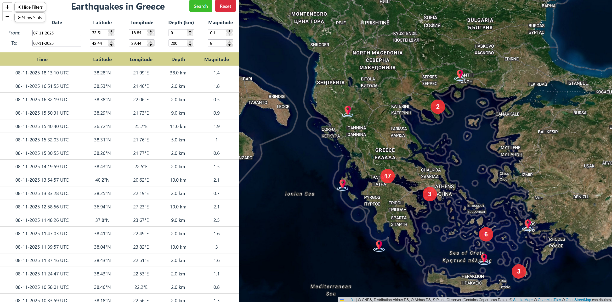
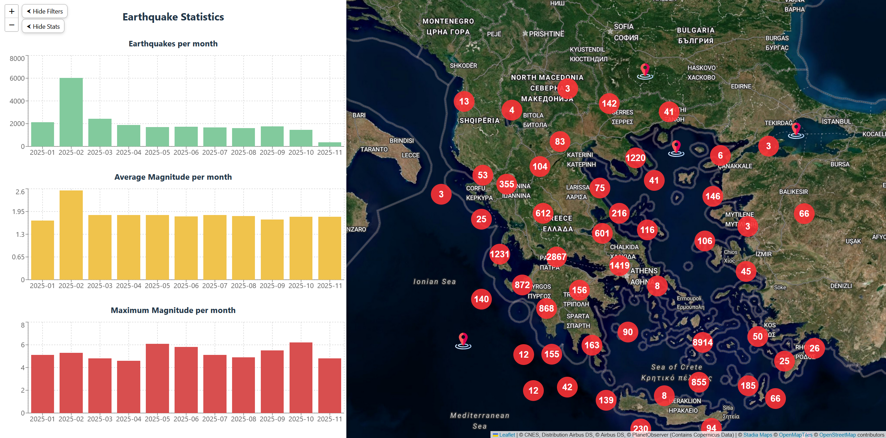
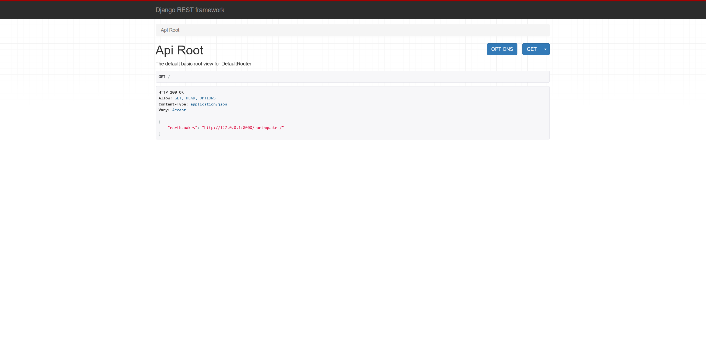

# Earthquake Monitoring Dashboard

## Overview

This project is a full-stack web application for monitoring and visualizing earthquake data in Greece. It provides:

- **Real-time earthquake data** from a database.
- **Interactive map** with clustered markers and heatmap visualization.
- **Statistics sidebar** with charts for number of earthquakes, average magnitude, and maximum magnitude over time.
- **Filtering** by date, latitude, longitude, depth, and magnitude.

---

## Features

- Earthquake list with table view and filters.
- Interactive Leaflet map with markers and clustering.
- Heatmap layer for large datasets.
- Dynamic statistics charts using Recharts.
- Automatic data fetching with a task scheduler.
- Supports SQLite or optional SQL database.
- Easy import of historical data from Excel files.




---

## Abstract

This project is part of my thesis for my Master's degree in Control and Computing at National and Kapodistrian University of Athens. This project is an integrated web application for monitoring and visualization of seismic data. The main objective of this work is the collection, processing and visualization of earthquakes recorded in real time in Greece.

The work combines backend and frontend technologies to create an integrated system, which allows the dynamic interaction of the user with geographic data through a modern, user-friendly website. The application collects seismic data in XML format from a public website of the Department of Geology and Geoenvironment of the National and Kapodistrian University of Athens. These data are processed and stored in the application's database, while through the implementation of a REST API using the Django REST Framework they are provided in an organized manner in the frontend of the application for viewing.

The frontend of the application was developed with React.js and the Leaflet library, which offers capabilities for displaying geospatial data on interactive maps. The user has the ability to display earthquakes of the last 24 hours or, using filters, search for seismic data for specific dates, geographic coordinates, seismic depths and seismic magnitudes. The application supports various visualization modes, such as clustering and heatmaps, allowing a better understanding of seismic activity over long periods of time.
This application offers a user-friendly platform for both researchers and the general public to explore not only recent, but also the entire seismic activity in the history of Greece, and constitutes a solid foundation for the development of new functions, such as the addition of a real-time notification system, seismic activity predictions using machine learning models, as well as the integration of data from international seismic networks.

This project supports automatic periodic data fetching from the remote XML feed using a simple Windows batch script combined with Task Scheduler. The script runs a Django management command (fetch_earthquakes) at regular intervals, such as every hour, to keep the database up to date with the latest earthquake data.

---

## Installation

### 1. Clone the repository

Open a terminal (Command Prompt / PowerShell / Git Bash) and run:

```bash
git clone https://github.com/loukasdrosos/Seismic-Monitor.git
cd Seismic-Monitor
```

### 2. Set up a Python virtual environment (recommended)

Creates an isolated Python environment separate from your system Python.
Contains its own python.exe and pip, so installed packages won't affect your global Python installation.

```bash
python -m venv venv
venv\Scripts\activate      # Windows
# source venv/bin/activate  # Mac/Linux
```

### 3. Set up the database

You can choose one of the following:

**Option 1:** Create an mySQL database

Install mySQL Workbench if you don't gave already and create a mySQL database for the project.

**Option 2:** Create a new SQLite database

Delete the current db.sqlite3 file in the backend\backend directory. Create a new database using Django in Step 6.

**Option 3:** Use the included SQLite database

The project contains a db.sqlite3 file filled with example data. Skip database creation and migrations (Step 6).

### 4. Install backend dependencies 

Go to the backend directory and install the dependencies from requirements.txt

```bash
cd backend
pip install -r requirements.txt
```

### 5. Configure .env variables for backend

Copy the example .env file and edit the values on the .env file.

```bash
copy .env.example .env      # Windows
# cp .env.example .env      # Mac/Linux
```

**Update the values according to your environment:**

Set DJANGO_SECRET_KEY to a secure random key. In order to generate a key open a command prompt window from the project's backend directory and run this command:

```bash
python -c "from django.core.management.utils import get_random_secret_key; print(get_random_secret_key())"
```

**DJANGO_SECRET_KEY** - Copy the output of the command above in the .env file.

**DJANGO_DEBUG** - Set to "True" only when in development mode, during Production set to "False".

**USE_SQLITE3** -  "True" if you are using an SQLite database, "False" if you are using a mySQL database.

**MYSQL_DB_ENGINE** - mySQL engine, don't change it.

**MYSQL_DB_NAME** - mySQL database name, necessary only if a mySQL database is used.

**MYSQL_DB_USER** - mySQL username, necessary only if a mySQL database is used.

**MYSQL_DB_PASSWORD** - mySQL password for user, necessary only if a mySQL database is used.

**MYSQL_DB_HOST** - mySQL database host server, necessary only if a mySQL database is used.

**MYSQL_DB_PORT** - mySQL database port, necessary only if a mySQL database is used.

**DATA_FETCH_URL** - Data source for automatic fetching of data. **WARNING**, changing feed may require change in parsing logic due to different XML/JSON structure.

**CORS_ALLOWED_ORIGINS** - Frontend origin URLs for CORS.

**IMPORT_DATA_PATH** - Excel filepath to use for manually loading data in the database.

**IMPORT_TIME_ZONE** - Time zone based on the source that data are being imported from. When importing data, the backend converts the times in the Excel file to the correct Django timezone.

### 6. Apply Migrations and Start Backend

If you created a new database (SQLite or MySQL), run on backend directory:

```bash
python manage.py makemigrations
python manage.py migrate
```

### 7. Start the Django server

Start the Django development server with this command:

```bash
python manage.py runserver
```

The backend API should now be running at http://127.0.0.1:8000/.



### 8. Import data from excel file (Optional)

If you created a new database you can import some data from earthquakes in Greece to test the application.

While on the project's backend directory run this command:

```bash
python import_excel_data.py
```

### 9. Install frontend dependencies

On a new terminal, navigate to the frontend directory and run:

```bash
cd frontend
npm install
```

### 10. Configure .env variables for backend

Copy the example .env file and edit the values on the .env file.

```bash
copy .env.example .env      # Windows
# cp .env.example .env      # Mac/Linux
```

**Update the values according to your environment:**

Edit .env and update the values:

**VITE_MINIMUM_LATITUDE / VITE_MAXIMUM_LATITUDE** – Minimum and maximum latitude for map filters.

**VITE_MINIMUM_LONGITUDE / VITE_MAXIMUM_LONGITUDE** – Minimum and maximum longitude for map filters.

**VITE_CENTER_LATITUDE / VITE_CENTER_LONGITUDE** – Initial center coordinates of the map.

**VITE_DEFAULT_ZOOM_LEVEL** – Default zoom level for the map.

**VITE_USE_STADIA** - Sets either Stadia map or OpenStreetMap for Leaflet.

**VITE_USE_STADIA_API_KEY** - Set to true if you want to use Stadia in production.

**VITE_STADIA_API_KEY** – Optional API key for Stadia Maps satellite tiles (needed only if you use Stadia tiles in production).

**VITE_API_URL** – The base URL of your backend Django REST API (e.g., http://localhost:8000).

### 11. Run the React frontend

On the frontend directory run:

```bash
npm run dev
```
The app will be available at http://localhost:5173/ (default Vite port).


### 12. Configure .env for automatic data fetching

In the Batch_script_data_fetching directory of the project, the batch script "fetch_earthquakes.bat" runs your Django manage.py fetch_earthquakes command using the paths and settings defined in the fetch_earthquakes.env configuration file.

Create a file named fetch_earthquakes.env in the same directory as the batch script, and fill it with the following values:

**BACKEND_DIR** - Full path to your Django backend folder (contains manage.py)

**VENV_PYTHON** - Full path to your Python interpreter inside virtual environment

**LOG_FILE** - Full path to where you want the log file saved

**Notes:**

Make sure all paths are absolute (full paths).

Use double backslashes \\ if you edit this in certain editors to avoid escaping issues.

The log file will record the time and result of each fetch operation.

### 13. Set Up Automatic Execution (Windows Task Scheduler)

You can make the "fetch_earthquakes.bat" script run automatically (for example, every hour) using Windows Task Scheduler.

**Steps:**

Open Task Scheduler (search “Task Scheduler” in the Start menu).

Click Create Task... on the right panel.

Under the General tab:

Name it: Earthquake Data Fetch.

Select Run whether user is logged on or not.

Check Run with highest privileges.

Under the Triggers tab:

Click New... → Choose Daily or Repeat task every 1 hour.

Set Start time as desired.

Under the Actions tab:

Click New...

Action: Start a program

Program/script: C:\Path\to\fetch_earthquakes.bat

(Optional) Under Conditions, uncheck “Start the task only if the computer is on AC power”.

Click OK to save, and enter your password if prompted.

The Task Scheduler will now run your data-fetching script automatically at the specified intervals.